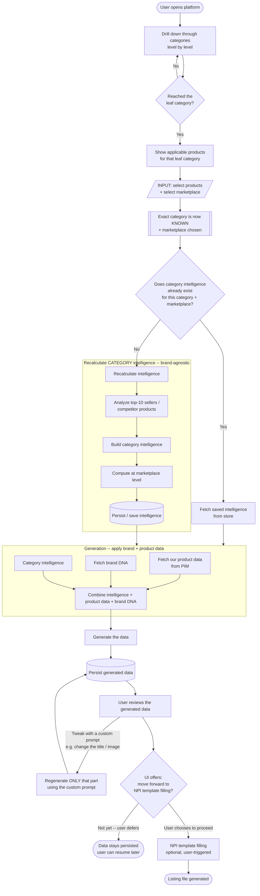
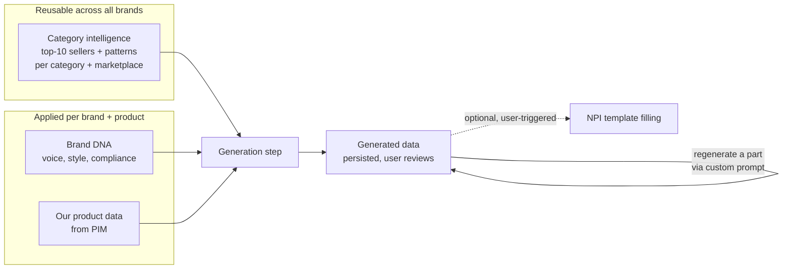
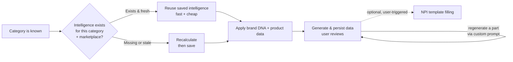

# AI Catalog Intelligence — Product & User Flow

A plain-language walkthrough of how a user moves through the platform, and how the system reuses or recalculates **category intelligence**, applies **brand DNA**, and generates data the user reviews — before *optionally* moving on to NPI template filling.

> **In one line:** The user drills down **category by category → Leaf Category**, then selects **the products AND the marketplace** — that pair is the **input**. Once products are picked, the exact category is known. The system then **reuses saved category intelligence if it already exists**, or **recalculates it** (top‑10 sellers / competitor analysis at the category + marketplace level). That intelligence is **brand-agnostic**. We then **apply brand DNA + our product data on top of it** to generate the data, which is **persisted** and shown to the **user to review**. Only when the user chooses to, they **move forward to the optional NPI template filling** step.

> ⚠️ **Key principle 1 — the input:** The input is always **selected products + selected marketplace**. The user reaches the leaf category, picks one or more products, *and* chooses the marketplace before anything is generated.

> ⚠️ **Key principle 2 — intelligence vs. brand:** **Intelligence does NOT include brand DNA.** Intelligence is built per **category + marketplace** so it can be reused across *every* brand. **Brand DNA is applied later**, at generation time, *together with* the intelligence.

> ⚠️ **Key principle 3 — NPI is optional & deferrable:** **NPI template filling is optional and never automatic.** The system generates the data, **persists it**, and shows it to the user. The UI then *offers* a "move forward to NPI template filling" step, which the **user explicitly chooses**. If the user isn't ready to generate the listing file yet, **the generated data stays persisted** and they can resume later.

> ⚠️ **Key principle 4 — targeted regeneration with custom prompts:** From the review screen, the user can **regenerate any single part** of the output (e.g., the title, a specific image, a bullet, the description) by giving a **custom prompt** — like *"change this in the image"* or *"make the title shorter."* Only that part is regenerated; everything else is untouched, and the **persisted data is updated** in place. The user can repeat this as many times as they want.

---

## 1. End-to-end flow

> Three things to note: (1) the generated data is **persisted before the decision**, so deferring loses nothing; (2) from review, the user can **regenerate any single part with a custom prompt** and the loop just re-persists that part; (3) the decision node is the **only** gate into NPI template filling — it never happens on its own.

---

## 2. Where intelligence ends and brand DNA begins

This is the distinction you called out — the two must stay separate.

**Why keep them separate?**
- **Reuse:** one category's intelligence serves *many* brands — no need to recompute per brand.
- **Cost:** the expensive analysis (competitor/top-seller) runs once per category + marketplace, not per brand.
- **Flexibility:** swapping or updating a brand's tone/style never invalidates the shared intelligence.
- **Consistency:** every brand competes against the *same* category benchmark, then differentiates via its own DNA.

---

## 3. The reuse vs. recalculate decision (zoomed in)

We do **not** recompute expensive intelligence every time.

**Rule of thumb:**
- **Exists → fetch from store** (instant, no AI cost).
- **Missing → recalculate, then persist** so the next run reuses it.
- *(Optional)* **Stale → refresh** on a schedule (e.g., every 30 days) so insights stay current.

---

## 4. Stage-by-stage (plain language)

| Step | What the user does | What happens behind the scenes |
|------|--------------------|--------------------------------|
| **1. Drill down** | Navigates categories level by level. | Products stay locked until a leaf is reached. |
| **2. Leaf reached** | Sees products for that exact category. | System now has the precise category. |
| **3. Select input** | Chooses one or more products **and** the marketplace. | This pair (**products + marketplace**) is the input; category is confirmed as the anchor for everything next. |
| **4. Check intelligence** | (nothing — automatic) | System checks if **category intelligence** already exists for the target marketplace. |
| **5a. Reuse** | (nothing — automatic) | If it exists, fetch the saved intelligence — fast and free. |
| **5b. Recalculate** | (nothing — automatic) | If not, analyze **top‑10 sellers / competitors**, build **category intelligence** (brand-agnostic), compute **per marketplace**, and save it. |
| **6. Apply brand + product** | (nothing — automatic) | Combine the intelligence with **our product data (PIM)** and **brand DNA**. |
| **7. Generate & persist** | Reviews the generated data. | The combined data is generated, **persisted**, and shown to the user for review. |
| **8. Tweak (optional, repeatable)** | Asks to **change a specific part** with a custom prompt (e.g., *"change this in the image"*, *"shorten the title"*). | Only that part is regenerated; the rest is untouched and the **persisted data is updated**. User can repeat this any number of times. |
| **9. Offer next step** | Sees a UI prompt: *"move forward to NPI template filling?"* | Nothing happens automatically — the system **waits** for the user. |
| **10. NPI template filling (optional)** | **Chooses** to proceed, or defers for now. | If the user opts in, the data fills the NPI template. If they defer, **the data stays persisted** and they can resume later. |

---

## 5. Why the "check first" step matters

- **Speed:** reused intelligence loads instantly.
- **Cost:** avoids re-running expensive competitor/top-seller analysis for a category we already understand.
- **Consistency:** every product in the same category + marketplace draws from the same shared benchmark.
- **Freshness (optional):** a scheduled refresh keeps insights current without a user having to trigger it.

---

## 6. Assumptions to confirm

- **Input** = **selected products + selected marketplace** (both chosen at the leaf step, before generation).
- **Entry point** = the user starts directly at the **category tree** and drills down (no themes).
- **Category intelligence** = brand-agnostic, built from top‑10 sellers / competitor analysis, stored per **category + marketplace**.
- **Brand DNA** = the brand's voice, style, compliance, and identity — **applied on top of** intelligence, never baked into it.
- **Our product data** = per-product info from the PIM, combined in at generation time.
- **Per marketplace** = intelligence is computed and stored separately per marketplace (Amazon ≠ Flipkart).
- **Generated data is persisted** as soon as it's produced — deferring NPI template filling never loses it.
- **Targeted regeneration** = from review, the user can regenerate **one part at a time** via a custom prompt; only that part changes and the persisted data is updated.
- **NPI template** = the marketplace listing template — filled **only as an optional, user-triggered step** after review.

**Open questions:**
1. Can a user select products across **multiple leaf categories** at once, or **one leaf at a time**?
2. Can the user select **multiple marketplaces** at once, or **one marketplace per run**?
3. What makes intelligence "**stale**" — a fixed schedule (e.g., 30 days), or a manual refresh?
4. For targeted regeneration, should we keep a **version history** of each part (so the user can revert), or just overwrite the current version?
