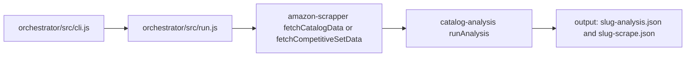
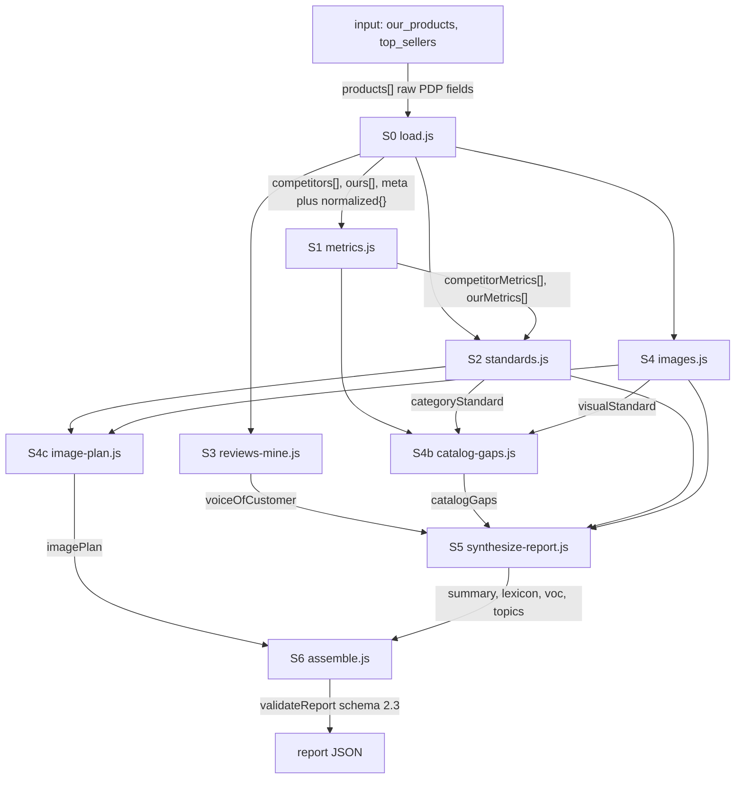
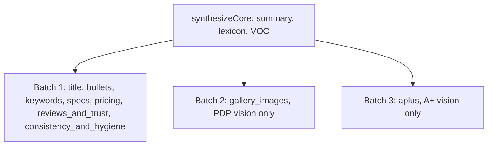
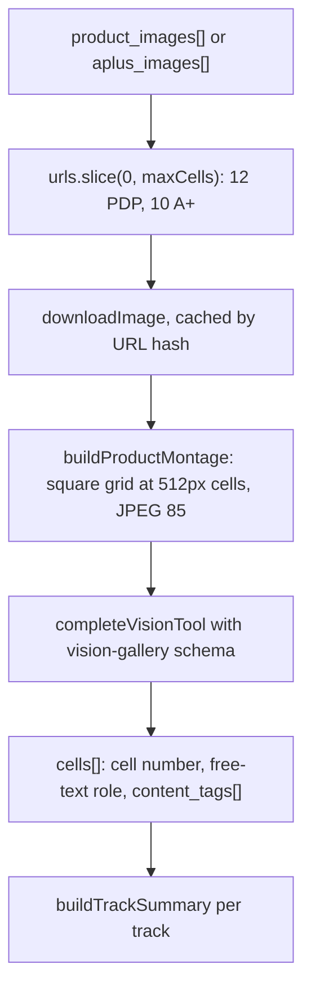
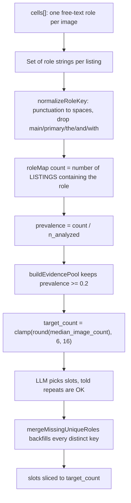
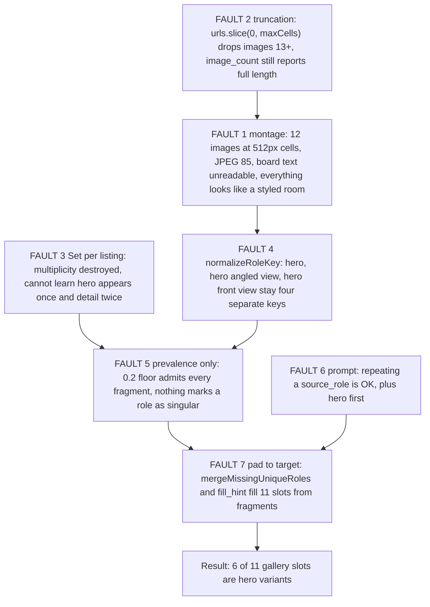
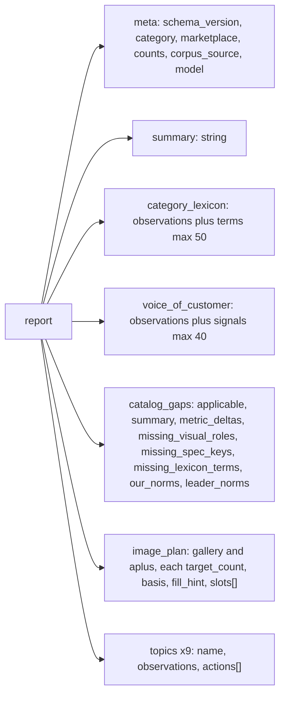

# Current architecture: how the pipeline works and where it breaks

Reference document describing the system **as it exists today** (report `schema_version` 2.5). It covers the packages, the stage graph, the exact JSON handed between stages, how every number is calculated, and the seven faults that produce low-quality gallery slot plans.

The improvement plan is a separate document. This file is purely a description of the present state.

---

## 1. Packages

Three Node packages in one repo, wired by the orchestrator.



| Package | Responsibility |
|---|---|
| `orchestrator` | One command: scrape, then analyse, then write both files |
| `amazon-scrapper` | Puppeteer. Bestseller list, product details, reviews, gallery and A+ images |
| `catalog-analysis` | Metrics, LLM research, vision, and the assembled intelligence report |

Entry points:

```bash
cd orchestrator
npm start -- --links-file rivals.csv [--url <product-url> ...]
npm start -- --category-url <bestsellers-url> --url <product-url> [--url ...]
```

`--links-file` is a CSV, newline URL list, or JSON of competitor PDP links. It skips the bestsellers page. `--url` (our listing) is required on the bestsellers path and optional on the links-file path. Requires Amazon cookies for the scraper and an LLM API key for the analysis.

---

## 2. What the scraper hands over

`fetchCatalogData` (bestsellers) and `fetchCompetitiveSetData` (links file) both return:

```json
{
  "corpus_source": "bestsellers | user_selected",
  "our_products": { "source": "our-products", "category": "...", "domain": "www.amazon.in", "products": [] },
  "top_sellers":  { "source": "best-sellers | user-selected", "category": "...", "domain": "www.amazon.in", "products": [] }
}
```

`our_products.products` may be empty. Category intelligence still runs; `catalog_gaps.applicable` is then `false`. `corpus_source: "user_selected"` means the competitive set came from a links file, not Amazon's bestsellers rank.

Each product carries 24 keys:

```
rank, asin, domain, label, url, category,
list_title, list_image_url, list_price_inr, list_rating, list_review_count,
title, brand, feature_bullets[], description,
product_details{}, price_text, rating_label, review_count_text,
product_images[], aplus_images[], aplus_text_blocks[],
reviews{}, scraped_at
```

Notable characteristics of this payload:

- `product_images` are upgraded to hi-res (`._AC_SL1500_.`) and deduped by image id.
- `aplus_images` keeps landscape media-library images only; `aplus_text_blocks` is a flat array with no module boundaries.
- `product_details` merges the product overview table, technical details table and detail bullets into one flat object.
- `price_text`, `rating_label` and `review_count_text` are raw strings; parsing happens later in analysis.
- `reviews` holds `{ auth_status, limits, total_fetched, by_star, items[] }`, up to 250 per product, 50 per star bucket.

---

## 3. The analysis stage graph



Deterministic stages: **S0, S1, S4b, S6**. LLM or vision stages: **S2, S3, S4, S4c, S5**.

Wiring lives in `catalog-analysis/src/pipeline/run.js`.

---

## 4. Data contract at each edge

### S0 load

Adds a `normalized` block to every product and splits the corpus into `competitors` and `ours`.

```json
{
  "price_inr": 539, "price_per_panel": 269, "rating": 3.9, "review_count": 750,
  "pack_count": 2, "bsr_rank": 12, "title_length": 184, "bullet_count": 5,
  "image_count": 9, "aplus_image_count": 3, "aplus_text_count": 21,
  "aplus_present": true, "spec_keys": ["Brand", "Size"]
}
```

`price_per_panel` is `price / pack_count`. `bsr_rank` is parsed from the Best Sellers Rank string.

### S1 metrics

Per-product metrics, then `aggregateNorms` produces `{ min, median, max }` bands per key. Median is the classic middle value, averaging the two middle entries on even counts. Metric keys include `title_length`, `bullet_count`, `image_count`, `aplus_image_count`, `spec_key_count`, `price_inr`, `price_per_panel`, `rating`, `review_count`.

### S2 categoryStandard

Deterministic parts (spec union, price bands, medians) merged with an LLM part (title template, keyword map, bullet topics).

```json
{
  "spec_union": [{ "key": "Opacity", "fill_rate": 0.9, "typical_values": ["100%"] }],
  "flagship_attribute": { "key": "Opacity", "tiers": ["100%", "Blackout"] },
  "price_band": { "per_set": { "min": 224, "median": 629, "max": 1281 } },
  "gallery_standard": { "median_images": 11, "min_images": 6, "max_images": 18 },
  "aplus_standard": { "median_modules": 6, "presence_rate": 0.4 },
  "title": { "template": "Brand + TC + Fabric + Size", "required_tokens": ["TC"] },
  "keyword_map": { "head": [], "long_tail": [], "vernacular": [], "occasion": [] }
}
```

`fill_rate` is the share of leader listings that have the spec key at all. If the LLM part is weak or fails, deterministic fallbacks fill `title` and `keyword_map`.

### S3 voiceOfCustomer

Two separate mining calls (leaders, ours), each returning:

```json
{ "signals": [{ "phrase": "colour mismatch", "sentiment": "complaint", "relevance": "high", "mention_count": 12 }],
  "themes": { "praise": [], "complaints": [], "objections": [] },
  "sampled_count": 120 }
```

Sampling caps: 80 negative (rating <= 2) and 40 positive (rating >= 4) reviews.

### S4 visualStandard

The structure that drives everything visual.

```json
{
  "pdp_summary": {
    "track": "pdp", "n_analyzed": 10, "median_image_count": 10.5,
    "roles": [{ "role": "styled-room hero", "count": 10, "prevalence": 1.0 }],
    "signals": [{ "signal": "human_presence", "count": 0, "prevalence": 0 }],
    "notes": [{ "note": "warm neutral palette", "count": 4, "prevalence": 0.4 }]
  },
  "aplus_summary": { "track": "aplus", "n_analyzed": 4, "median_image_count": 6.5 },
  "gallery_standard": { "required_roles": [], "hero_conventions": [], "quality_notes": [] },
  "ours_vs_leaders": { "galleries_analyzed": 2, "role_rates": [], "missing_vs_leader_required": [] },
  "per_product_gallery": [{ "asin": "B0X", "cells": [{ "cell": 1, "role": "hero", "content_tags": [] }] }]
}
```

PDP and A+ are kept as separate tracks end to end and are never merged into one bucket.

### S4b catalogGaps

Pure arithmetic, no LLM:

- `metric_deltas` from the leader norms versus our norms
- `missing_spec_keys` by comparing leader `fill_rate` against our fill rate
- `missing_lexicon_terms` by lowercase substring search of each keyword-map term against our concatenated title, bullets, A+ text and description
- `missing_visual_roles` passed straight through from `ours_vs_leaders`
- `summary` built by string assembly from the above

### S4c imagePlan

Consumes only `pdp_summary.roles`, `aplus_summary.roles` and the two medians. Produces `image_plan.gallery` and `image_plan.aplus`.

### S5 synthesize

Four LLM calls: one core call (summary, lexicon, voice of customer) plus three topic batches in parallel.



`scopeResearchForTopics` enforces isolation: the gallery prompt never sees A+ evidence and vice versa. Voice of customer is stripped from all topic batches since core already wrote it.

### S6 assemble

Builds the final object and runs `validateReport`. Lexicon is filtered to high and medium relevance, capped at 50 terms; voice signals capped at 40.

---

## 5. How the vision path works today



The vision prompt asks for a free-text `role` per cell plus open-vocabulary `content_tags`, and separately `present_roles`, `quality_notes` and, for PDP only, `hero_conventions`.

Derived signals come from `vision-signals.js`, which currently defines exactly one detector: `human_presence`, a regex over the content tags.

---

## 6. How slot counts are actually calculated



Concrete normalization behaviour, which matters a great deal:

| Raw role from vision | Normalized key |
|---|---|
| `styled-room hero` | `styled room hero` |
| `styled-room hero (angled view)` | `styled room hero angled view` |
| `styled-room hero (front view)` | `styled room hero front view` |
| `styled-room hero (alternate angle)` | `styled room hero alternate angle` |
| `fabric close-up` | `fabric close up` |
| `fabric/texture close-up` | `fabric texture close up` |
| `fabric pattern close-up` | `fabric pattern close up` |

None of those collapse together. Parentheses become spaces but the words survive, so every phrasing variant is a separate role in the statistics.

---

## 7. The seven faults



Detail on each:

1. **Montage illegibility.** `montageCellSize: 512` with `montageMaxCells: 12` produces a 4x3 sheet where each image occupies under 500px, then the whole thing is JPEG-85. Size charts, comparison tables and feature callouts cannot be read, so the model describes the only thing still visible: a room with the product in it. This is the single largest cause of hero-labelled everything.
2. **Truncation.** `analyzeProductGalleries` downloads `urls.slice(0, maxCells)`. An 18-image leader gallery loses its tail, which is exactly where size and comparison boards usually sit. Meanwhile `image_count` is set from the full `urls.length`, so the medians describe images the model never saw.
3. **Multiplicity destroyed.** `buildTrackSummary` puts each listing's roles into a `Set` before counting, so "this gallery had three detail shots" becomes "this gallery had detail shots". There is no field anywhere expressing that a hero occurs once per listing.
4. **Role fragmentation.** As shown in section 6, phrasing variants never merge.
5. **Prevalence is the only ranking signal.** `buildEvidencePool` keeps anything at or above 0.2 prevalence, so four hero fragments each seen in 20 percent of galleries all become legitimate menu items.
6. **The prompt invites repeats.** Two lines do damage: "Repeating an allowed source_role is OK when leaders clearly use that pattern more than once" and "Order slots as a recommended sequence (hero/opening first for PDP when evidenced)".
7. **Padding to the target.** `mergeMissingUniqueRoles` backfills every distinct normalized key until `target_count` is reached, and `fill_hint: repeat_highest_prevalence_observed_slots` tells downstream consumers to duplicate further.

Observed outcome in `output/bedding-duvet-cover-sets-analysis.json`: `target_count: 11`, eleven slots, of which six are hero or near-hero variants, with no size, comparison or contents board despite those being common in the category.

---

## 8. Report shape today



Required topics: `title`, `bullets`, `keywords`, `gallery_images`, `aplus`, `specs`, `pricing`, `reviews_and_trust`, `consistency_and_hygiene`.

Every topic is `{ name, observations, actions[] }` and nothing more. Structured visual guidance lives only in `image_plan`.

---

## 9. LLM usage summary

All structured calls go through `completeTool` or `completeVisionTool` in `catalog-analysis/src/services/llm.js`, using Anthropic with a forced tool schema loaded from `catalog-analysis/src/domain/schemas/`.

| Stage | Tool schema | maxTokens |
|---|---|---|
| S2 standards | `standards-llm` | 4096 |
| S3 reviews mining, twice | `voice-of-customer-mine` | 4096 |
| S4 vision, once per product per track | `vision-gallery` | 20000 |
| S4c image plan | `image-plan` | 4096 |
| S5 core | `synthesize-core` | 20000 |
| S5 topics, three batches | `synthesize-topics` | 20000 |

Retry is three attempts with 2s and 4s backoff, with no distinction between rate limits and validation errors. The system prompt is marked as an ephemeral cache breakpoint on the tool paths. Only downloaded images are cached on disk; vision results are not.

---

## 10. Known gaps beyond the visual path

- Amazon capped titles at 75 characters in July 2026 and added a separate searchable 125-character Item Highlights field. The pipeline still models the title as one long string and has no highlights concept, so its title guidance is out of date.
- There is no backend keyword output. `category_lexicon.terms` is close but is a vocabulary list, not a budgeted search-terms field.
- The scraper does not capture item highlights, breadcrumbs, badges, variation data, image alt text, or A+ module boundaries.
- The non-visual synthesis batch carries seven topics in a single call against the largest research payload of the run.
